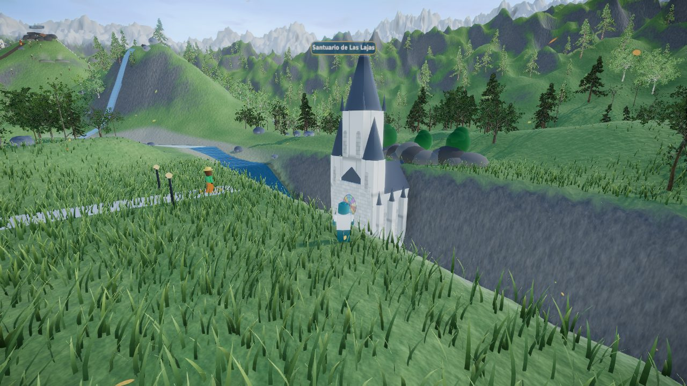
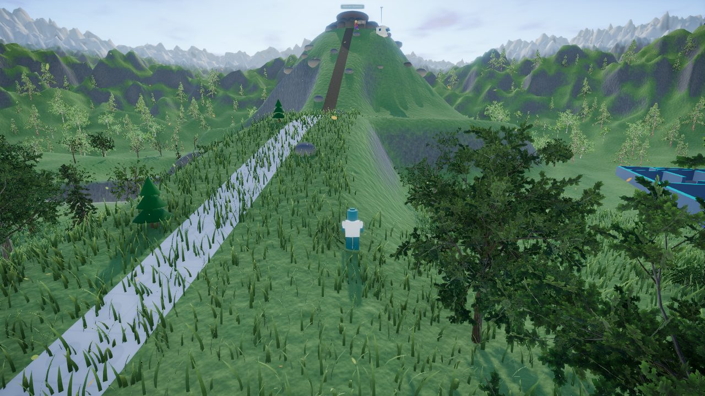
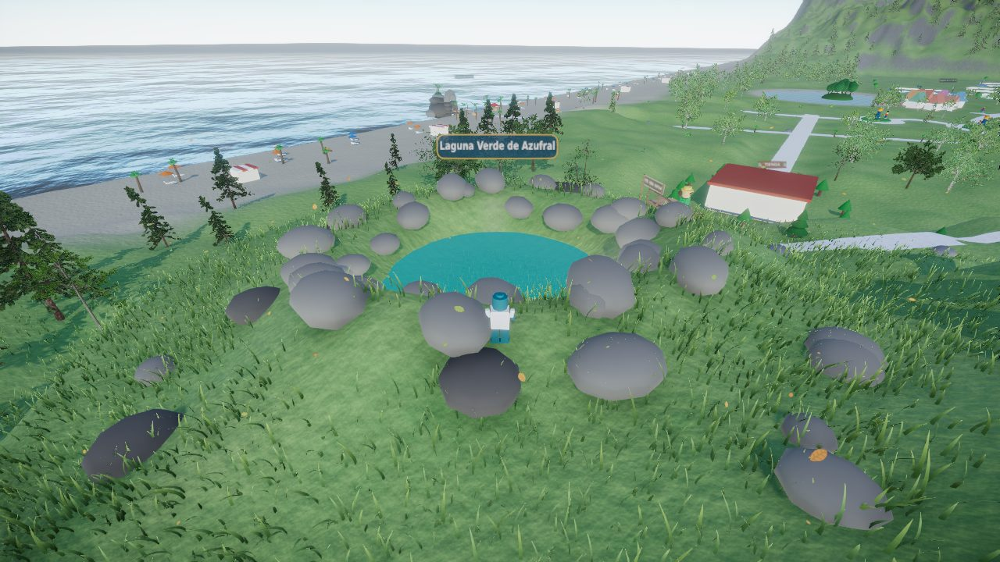
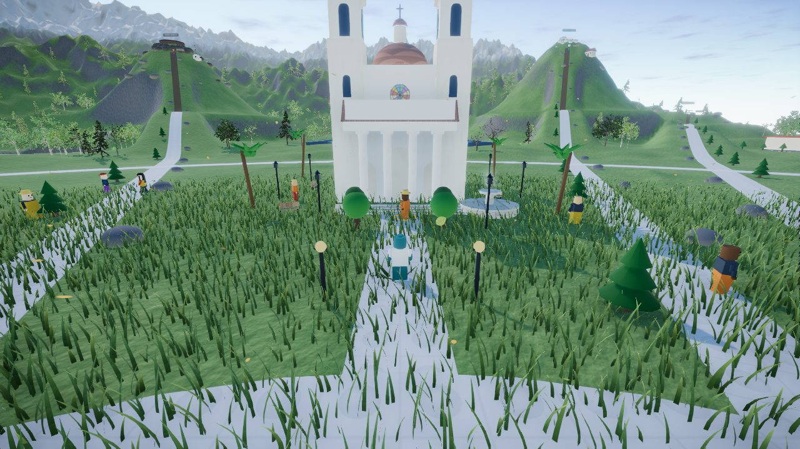
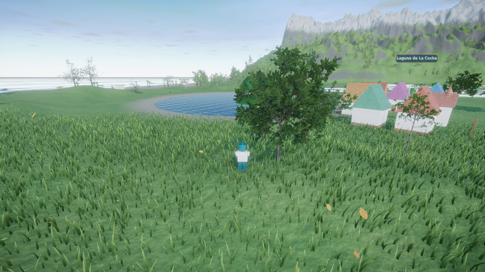
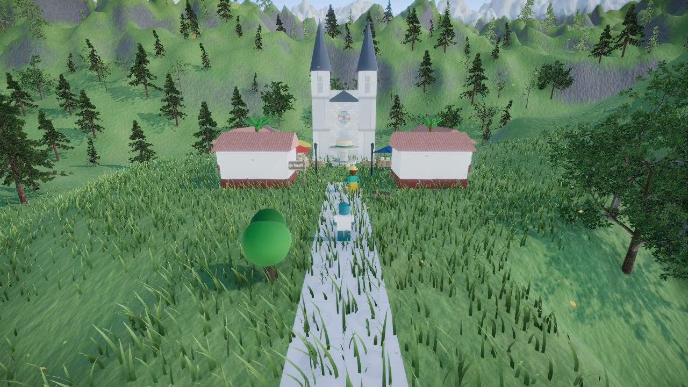
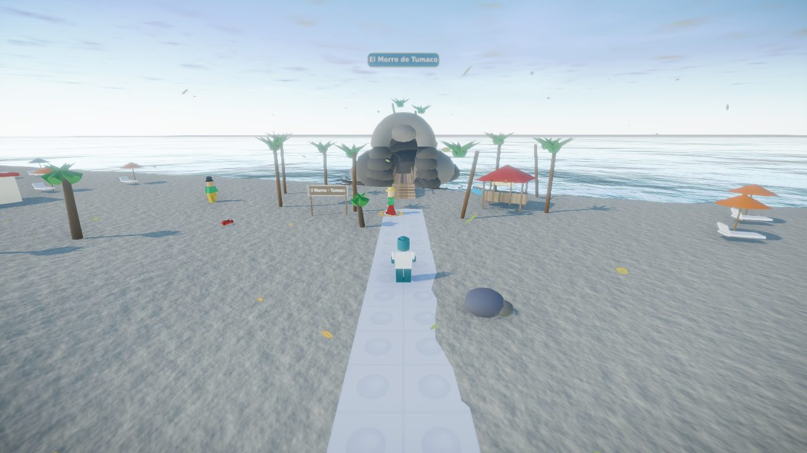
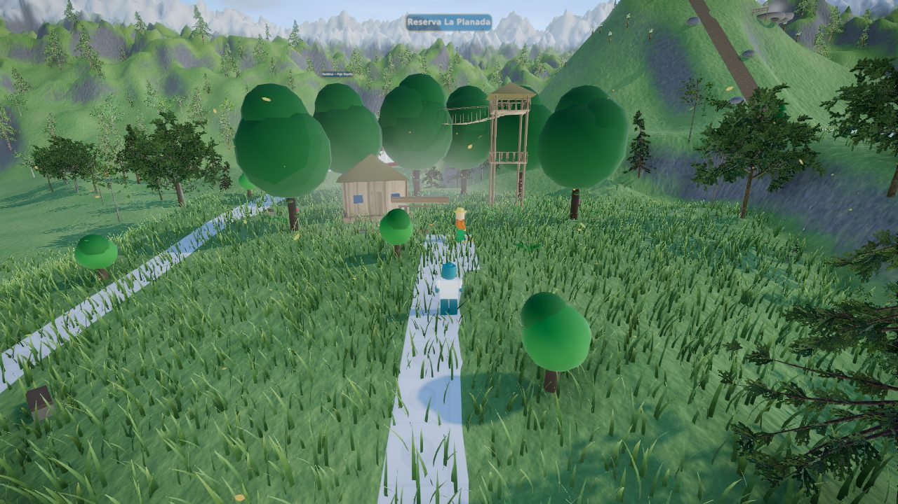

# Nariño Aventura 3D

Mundo abierto educativo de la Gobernación de Nariño construido con **Three.js**: el
jugador recorre un Nariño en miniatura (Las Lajas, La Cocha, Galeras, Cumbal,
Azufral, la Catedral de Pasto, La Planada, El Morro de Tumaco, Chiles y Sandoná),
responde preguntas, descubre fauna, juega en el complejo deportivo, resuelve el
laberinto y compra atuendos en la tienda Ñaño.

Esta versión convierte el mundo plano original en un **entorno realista**
(terreno con colinas y cordillera, césped que se mueve con el viento, bosques,
lagos, río, cascada y mar del Pacífico, cielo físico y postprocesado), añade
**modo multijugador** entre navegadores sin necesidad de servidor, organiza el
mundo en **niveles de terreno** (terrazas, cañón, volcanes que se escalan por
un sendero), **reubica y rediseña los diez sitios turísticos** siguiendo la
forma real de cada lugar y adopta **controles de videojuego** (ratón para la
cámara, flechas para moverse, C para cambiar de cámara, clics para patear y
agarrar).

> Documentación técnica completa: [`docs/ENTORNO-REALISTA.md`](docs/ENTORNO-REALISTA.md)

| | |
|---|---|
|  |  |
|  |  |
|  |  |
|  |  |

## Requisitos

- Node.js 20 o superior (probado con Node 22).
- Navegador con WebGL 2 (Chrome, Edge, Firefox, Safari 16+).

## Desarrollo

```bash
npm install
npm run dev        # servidor de desarrollo con recarga en vivo
npm run build      # genera index.html + assets/ en la raíz del repositorio
```

## Despliegue en hosting estático

El juego es 100 % estático. Tras `npm run build`, copia a la carpeta pública del
sitio (por ejemplo, junto a `wj-admin`, `wj-content` y `wj-includes`) estos
archivos y carpetas:

```
index.html
assets/
aventura-narino.mp3
```

No hace falta Node.js ni base de datos en el servidor. Todas las rutas del build
son relativas (`./assets/...`), así que puede vivir en cualquier subcarpeta,
por ejemplo `https://sitio.gov.co/aventura/`.

## Parámetros de URL

| Parámetro | Valores | Efecto |
|---|---|---|
| `?calidad=` | `alta`, `media`, `baja` | Fuerza el perfil gráfico (por defecto se detecta según el dispositivo). |
| `?sala=` | texto | Sala multijugador. Quienes abran la misma sala se ven entre sí. Por defecto `narino-principal`. |
| `?red=` | `p2p` (defecto), `relay`, `off` | Transporte de red: WebRTC entre navegadores, servidor relay o desactivado. |
| `?relay=` | `wss://host:puerto` | URL del servidor relay (ver `server/`). |
| `?fps=1` | | Muestra el contador de cuadros por segundo. |

## Controles

Controles clásicos de videojuego en tercera persona: **el cursor da la
dirección** y las flechas mueven al personaje respecto a la cámara.

| Control | Acción |
|---|---|
| Ratón | Dirige la cámara. Haz clic en el juego para capturar el cursor; `Esc` lo libera. |
| ↑ ↓ (o W S) | Avanzar / retroceder hacia donde mira la cámara |
| ← → (o A D) | Desplazarse a los lados. Si el ratón no está capturado, giran la cámara. |
| Shift | Correr |
| Espacio | Saltar |
| C | Cambiar cámara: tercera persona → panorámica → primera persona |
| Clic izquierdo / F | Patear o lanzar el balón (hacia donde mira la cámara) |
| Clic derecho / G | Agarrar / soltar el balón |
| E | Responder la pregunta del sitio |
| H | Pedir pista a un guía |
| B | Subir o bajar de la patineta |
| Enter | Abrir el chat (multijugador) |

En móviles y tabletas: joystick para moverse, arrastre en la mitad derecha de
la pantalla para girar la cámara y botones en pantalla (incluidos 📷 cámara y
B patineta).

## El mundo

- **Niveles del terreno.** Cada sitio se asienta en una terraza a su propia
  cota; el sendero desde la plaza sube en rampa hasta ella. El río Guáitara
  nace en la cascada, baja por rápidos y se encajona en un cañón de 12 m bajo
  el Santuario de Las Lajas hasta una laguna baja. Los volcanes Galeras,
  Cumbal, Chiles y Azufral son conos reales del terreno: se suben por un
  sendero de tierra hasta el cráter.
- **Sitios turísticos rediseñados** a partir de su forma real: el puente de dos
  niveles y la basílica neogótica de Las Lajas sobre el cañón; el caserío
  alpino de El Encano con muelle, lanchas y la Isla La Corota dentro del lago;
  el cráter humeante del Galeras con su caseta de vigilancia; el casquete
  glaciar del Cumbal; la laguna turquesa en el cráter del Azufral; la catedral
  republicana de Pasto con cúpula, torres y atrio; el portal, la cabaña y la
  torre de dosel de La Planada; el peñón con arco de El Morro y su puente de
  madera; el páramo de frailejones y las termales del Chiles; la iglesia de
  piedra, las casas coloniales y el mercado de sombreros de Sandoná.

## Estructura del proyecto

```
src/
  main.js            arranque
  game/Game.js       orquestador: mundo, sistemas, HUD y bucle de render
  core/              entrada (teclado, ratón con Pointer Lock), cámara orbital, colisiones
  entities/          jugador, balones, NPC, fauna, patineta
  world/             plaza, senderos, vías, sitios (siteBuilders + siteParts), complejo deportivo, laberinto, tienda, layout
  environment/       terreno, atmósfera, césped, árboles, agua, hojas, postprocesado, calidad
  net/               multijugador (transportes P2P/relay y sincronización)
  ui/                paneles, chat, minimapa, controles táctiles
  data/              preguntas, artículos de la tienda, recompensas
  systems/           progreso, inventario, ranking, sonidos
  vendor/ez-tree/    generador de árboles (MIT) con texturas recortadas
server/              relay WebSocket opcional para el multijugador
scripts/build.mjs    build limpio (borra assets/ y ejecuta Vite)
```

## Licencias de terceros

Three.js (MIT), pmndrs/postprocessing (Zlib), N8AO (ISC), simplex-noise (MIT),
Trystero (MIT), ez-tree de Daniel Greenheck (MIT, código y texturas incluidos en
`src/vendor/ez-tree`).
