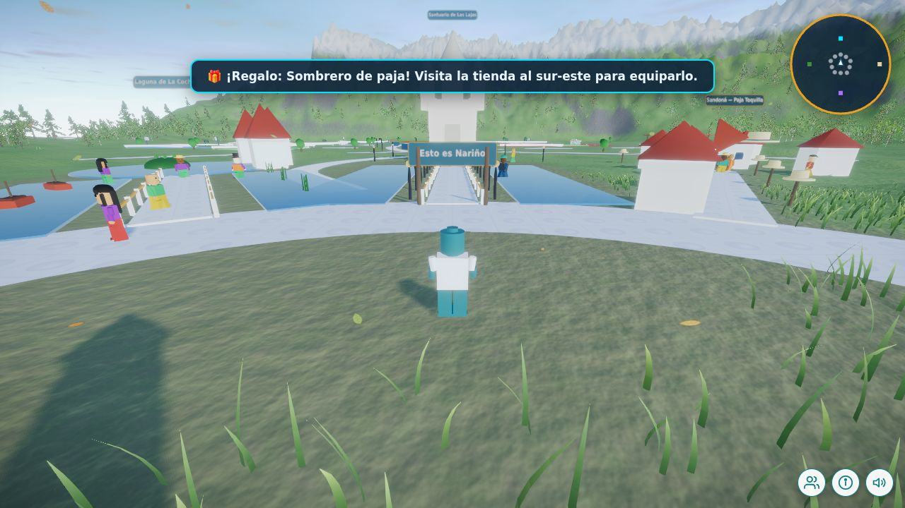
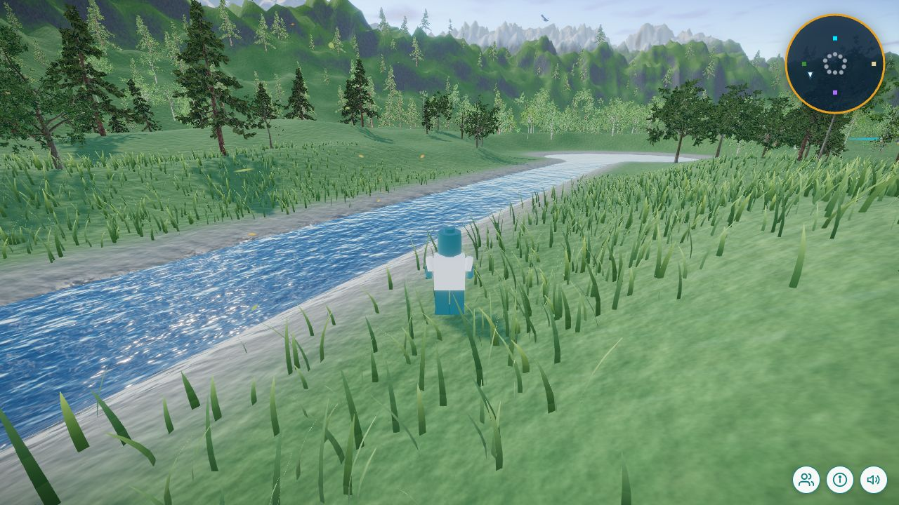
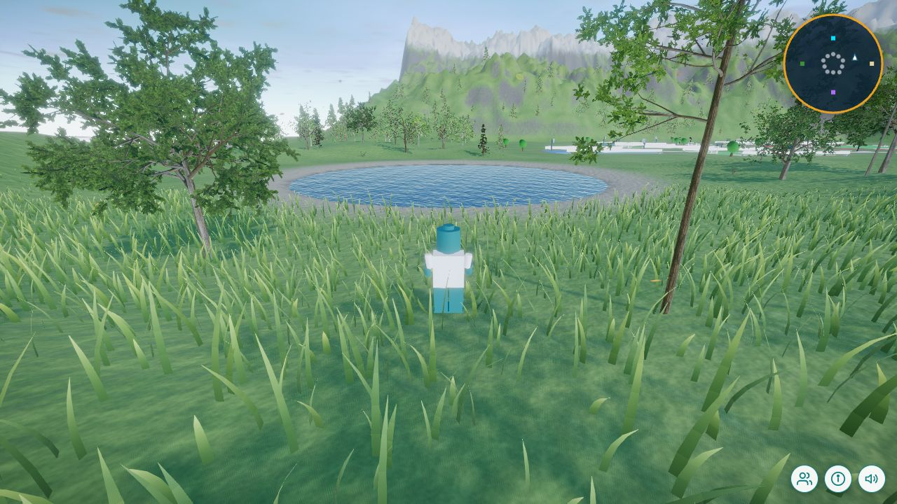
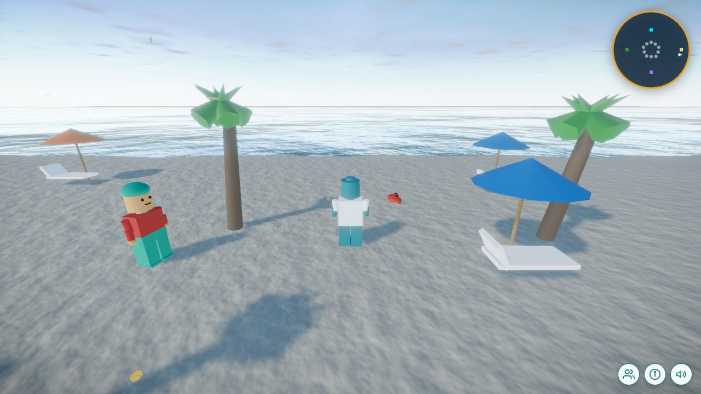

# Nariño Aventura 3D

Mundo abierto educativo de la Gobernación de Nariño construido con **Three.js**: el
jugador recorre un Nariño en miniatura (Las Lajas, La Cocha, Galeras, Cumbal,
Azufral, la Catedral de Pasto, La Planada, El Morro de Tumaco, Chiles y Sandoná),
responde preguntas, descubre fauna, juega en el complejo deportivo, resuelve el
laberinto y compra atuendos en la tienda Ñaño.

Esta versión convierte el mundo plano original en un **entorno realista**
(terreno con colinas y cordillera, césped que se mueve con el viento, bosques,
lagos, río, cascada y mar del Pacífico, cielo físico y postprocesado) y añade
**modo multijugador** entre navegadores sin necesidad de servidor.

> Documentación técnica completa: [`docs/ENTORNO-REALISTA.md`](docs/ENTORNO-REALISTA.md)

| | |
|---|---|
|  |  |
|  |  |

## Requisitos

- Node.js 20 o superior (probado con Node 22).
- Navegador con WebGL 2 (Chrome, Edge, Firefox, Safari 16+).

## Desarrollo

```bash
npm install
npm run dev        # servidor de desarrollo con recarga en vivo
npm run build      # genera index.html + assets/ en la raíz del repositorio
```

## Despliegue en hosting estático

El juego es 100 % estático. Tras `npm run build`, copia a la carpeta pública del
sitio (por ejemplo, junto a `wj-admin`, `wj-content` y `wj-includes`) estos
archivos y carpetas:

```
index.html
assets/
aventura-narino.mp3
```

No hace falta Node.js ni base de datos en el servidor. Todas las rutas del build
son relativas (`./assets/...`), así que puede vivir en cualquier subcarpeta,
por ejemplo `https://sitio.gov.co/aventura/`.

## Parámetros de URL

| Parámetro | Valores | Efecto |
|---|---|---|
| `?calidad=` | `alta`, `media`, `baja` | Fuerza el perfil gráfico (por defecto se detecta según el dispositivo). |
| `?sala=` | texto | Sala multijugador. Quienes abran la misma sala se ven entre sí. Por defecto `narino-principal`. |
| `?red=` | `p2p` (defecto), `relay`, `off` | Transporte de red: WebRTC entre navegadores, servidor relay o desactivado. |
| `?relay=` | `wss://host:puerto` | URL del servidor relay (ver `server/`). |
| `?fps=1` | | Muestra el contador de cuadros por segundo. |

## Controles

| Tecla | Acción |
|---|---|
| W A S D / flechas | Moverse y girar |
| Shift | Correr |
| Espacio | Saltar |
| E | Responder la pregunta del sitio |
| F / G | Patear o lanzar / agarrar el balón |
| H | Pedir pista a un guía |
| B | Subir o bajar de la patineta |
| Enter | Abrir el chat (multijugador) |

En móviles y tabletas aparecen un joystick y botones en pantalla.

## Estructura del proyecto

```
src/
  main.js            arranque
  game/Game.js       orquestador: mundo, sistemas, HUD y bucle de render
  core/              entrada, cámara, colisiones (índice espacial)
  entities/          jugador, balones, NPC, fauna, patineta
  world/             plaza, senderos, vías, sitios, complejo deportivo, laberinto, tienda, layout
  environment/       terreno, atmósfera, césped, árboles, agua, hojas, postprocesado, calidad
  net/               multijugador (transportes P2P/relay y sincronización)
  ui/                paneles, chat, minimapa, controles táctiles
  data/              preguntas, artículos de la tienda, recompensas
  systems/           progreso, inventario, ranking, sonidos
  vendor/ez-tree/    generador de árboles (MIT) con texturas recortadas
server/              relay WebSocket opcional para el multijugador
scripts/build.mjs    build limpio (borra assets/ y ejecuta Vite)
```

## Licencias de terceros

Three.js (MIT), pmndrs/postprocessing (Zlib), N8AO (ISC), simplex-noise (MIT),
Trystero (MIT), ez-tree de Daniel Greenheck (MIT, código y texturas incluidos en
`src/vendor/ez-tree`).
